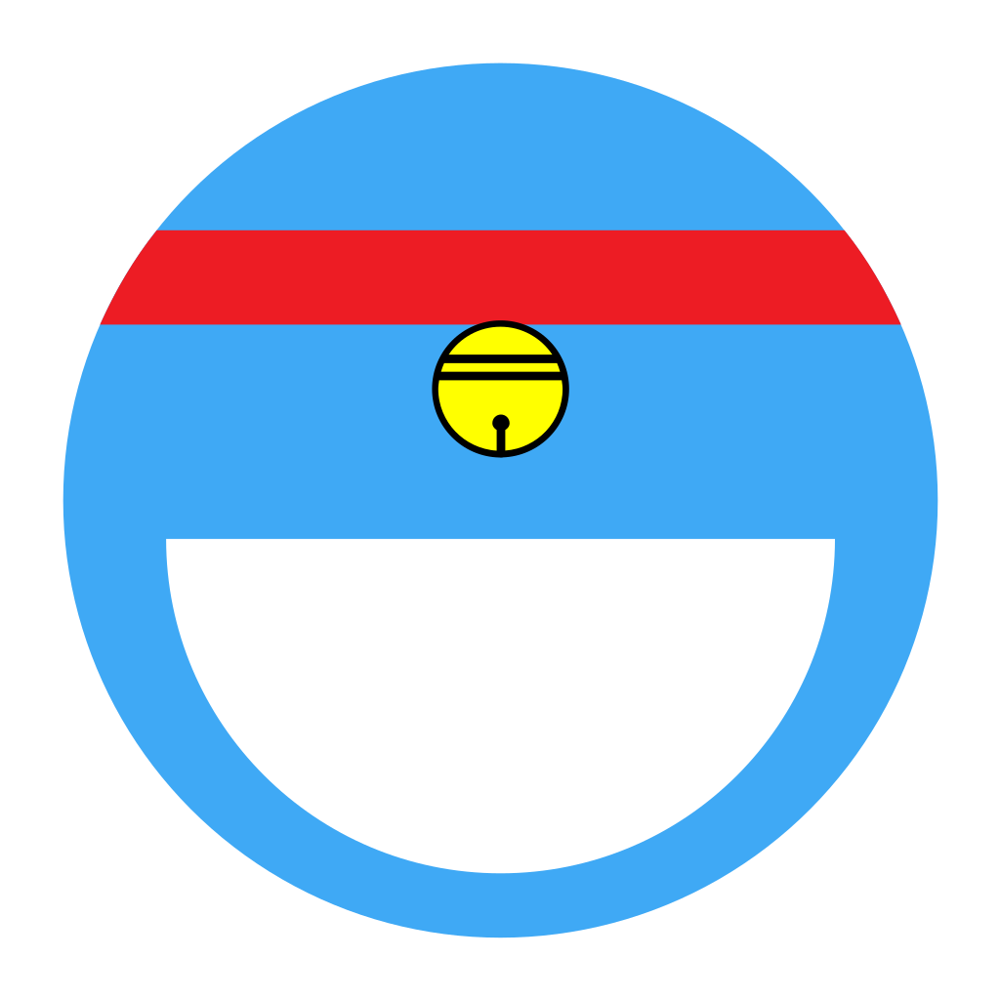
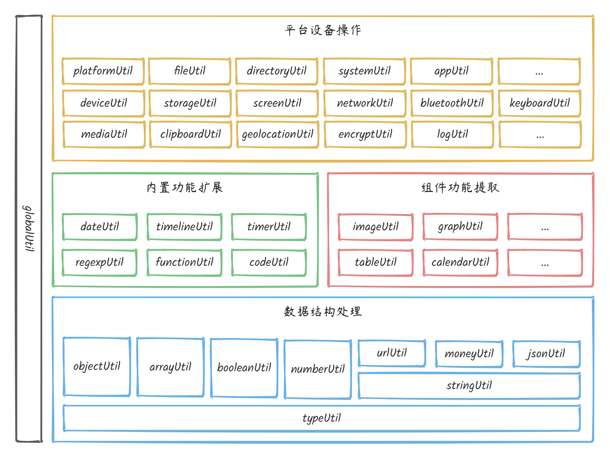

<div align="center"><a name="readme-top"></a>



<h1>@yincw/dora</h1>

一个 JavaScript 通用函数工具库。



[API 参考手册](https://yincw.github.io/dora/)

</div>

<!-- ## ✨ 特色 -->

## 🖥 环境支持

- Web 应用
- 小程序（微信、抖音、支付宝、QQ ...）
- [React Native](https://reactnative.dev/) 应用
- [Electron](https://www.electronjs.org/) 应用
- [Node.js](https://nodejs.org/) 应用

| [](http://godban.github.io/browsers-support-badges/)<br>Chrome | [](http://godban.github.io/browsers-support-badges/)<br>Firefox | [](http://godban.github.io/browsers-support-badges/)<br>Safari | [](http://godban.github.io/browsers-support-badges/)<br>Edge | [](http://godban.github.io/browsers-support-badges/)<br>Electron |
| --- | --- | --- | --- | --- |
| last 2 versions | last 2 versions | last 2 versions | Edge | last 2 versions |

## 📦 安装

```js
// npm install --save @yincw/dora
npm i @yincw/dora

// pnpm
pnpm add @yincw/dora
```

## 🔨 使用


模块化用法：

```js
// ES Modules
import { isObject } from '@yincw/dora';
let obj = {};
isObject(obj); // => true
isObject(''); // => false

// CommonJS: Node.js 模块
const { isObject } = require('@yincw/dora');
var obj = {};
isObject(obj); // => true
isObject(''); // => false
```


```html
<!-- AMD：Require.js 模块 -->

<!-- index.html -->
<script src="./require.js" data-main="./main.js"></script>
```
```js
// main.js

// 方式一：方法维度
define(['../dist/typeUtil/isObject'], function (module) {
  var obj = {};
  console.log('isObject', module.isObject(obj)); // => true
});

// 方式一：方法组维度
define(['../dist/typeUtil/index'], function (module) {
  var typeUtil = module.default;
  var obj = {};
  console.log('typeUtil.isObject', typeUtil.isObject(obj)); // => true
  console.log('typeUtil.isNull', typeUtil.isNull(null)); // => true
});
```

全量引入：

```html
<!-- index.html -->
<script src="/dist/dora.min.js"></script>
```
```js
// main.js
let obj = {};

// 方式一：命名空间-方法组维度
var Dora = dora.default;
Dora.typeUtil.isObject(obj); // => true
Dora.typeUtil.isNull(null); // => true

// 方式二：方法维度
dora.isObject(obj); // => true
```

## ⌨️ 开发

```js
// 开发
npm run dev

// 构建
npm run build

// 单元测试
npm run test
// 测试覆盖范围
npm run test:coverage
// 端对端测试
npm run test:e2e

// 文档
npm run docs
```

通过样板命令，自动化创建对应的 源码样板及测试用例样板。

#### 创建样板

会在 src 和 tests 下创建对应目录及文件，并且，src 目录 index.ts 文件会自动更新导入导出函数。

```js
// 自动生成样板
npm run gen type isObject
```

#### 移除样板

会移除 src 和 tests 目录对应的样板文件；且 src 目录下 index.ts 引用会自动更新。

```js
// 自动移除样板
npm run del type isObject
```

## ❤️ 支持

如果当前工具有帮助到您，请作者喝杯咖啡吧 (●'◡'●)

微信 |  | 支付宝
---|---|---
  |  | 

## LICENSE

MIT
